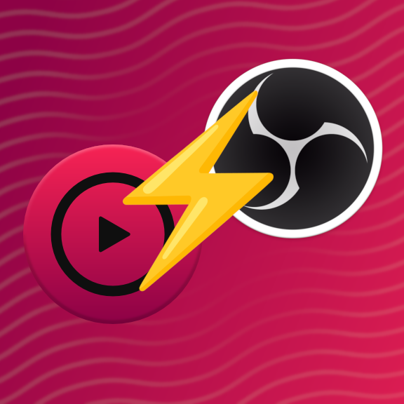
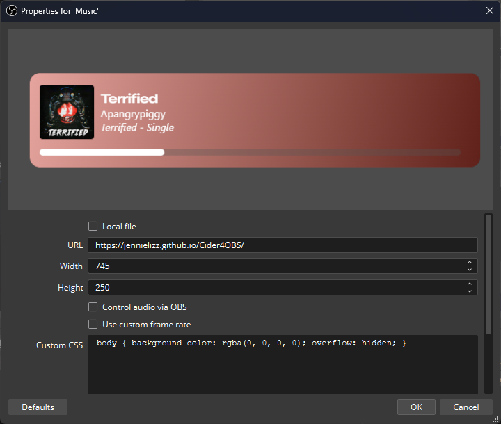

<div align="center">


# Cider 4 OBS
### Connect your Cider Client to OBS and show what you're listening to!


</div>

## The default player
<div align="center">

</div>


## Requirements
* [Open Broadcaster Software](https://obsproject.com/)
* [Cider 2.5+](https://cider.sh)
* An Apple Music subscription.

## Setup
1. Setup Cider if you haven't done so already and open the settings. Go to "Connectivity" and scroll down all the way. Enable the Switch "WebSockets API".
2. Create a new Browser Source in OBS and set the URL to [`https://jennielizz.github.io/cider4obs-better/`](https://jennielizz.github.io/cider4obs-better/).
3. Set the source size to a width of `745` and a height of `250`. Resize with the transform controls or scale up those values uniformly. (if you don't there will be issues, only do this in general if you need a higher resolution.)
4. The browser in OBS will now attempt to connect to Cider every five seconds and reestablish the connection if necessary!
5. If you want to customize how the app is looking, read below. Add the options into the Custom CSS box of OBS!

### Text Customizations
Customizable elements are `span, #title, #album, #artist`.
```css
/* you can change the secondary font with: */
span {
  font-family: "Segoe UI", Tahoma, Geneva, Verdana, sans-serif;
}

/* and the song title: */
#title {
  font-weight: bold;
  font-family: "SF Pro";
  font-stretch: expanded;
  font-size: 20px; /* Probably don't change, but its here */
}

/* artist and album: */
#artist #album {
  font-family: "Atkinson Hyperlegible";
  font-size: 30px;
}
```

### Settings
Some settings adjusting the behavior of certain elements. (These are the defaults)
```css
body {
  /* general key unless stated otherwise: 1=on, 0=off */
  
  /* fade the box in and out depending on whether music is playing or not */
  --fade-on-stop: 1;

  /* how long playback must be paused in milliseconds until the box fades (if enabled) */
  --fade-delay: 1000;

  /* the box will fade out when Cider disconnects and appears on reconnecting */
  --fade-on-disconnect: 1;

  /* the delay in milliseconds after the player has disconnected until the box fades */
  --fade-disconnect-delay: 3000;

  /* hides the box when connection has been established but Cider is idle */
  --hide-on-idle-connect: 1;
}
```

## Trusted by streamers
Thank you for supporting this project by using and spreading it! You are my heroes!

<div align="center">

| [iamtheratio](https://www.twitch.tv/amtheratio) |
|:-:|
| [](https://www.twitch.tv/iamtheratio) |

</div>

Do you want to appear here? Open a new issue and outline your involvement. I'll be happy to add you here!

## Special Thanks
A list of entities I want to thank for supporting me in different ways!

<div align="center">

| [<br>Cider Collective](https://github.com/ciderapp/) |
| :-: |
| Thank you so much for giving me access to early builds,<br>making change response much faster! |

| [<br>Aquasius](https://www.twitch.tv/aquasius) |
| :-: |
| Thanks for the original idea, initial feedback,<br>and the driving force to make this open source! |
</div>
